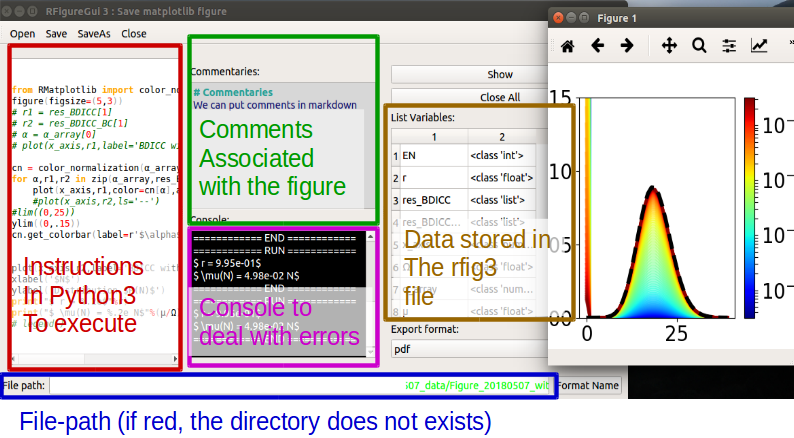

# RFigure version 3

[](https://opensource.org/licenses/GPL-3.0/)
[](https://travis-ci.com/grumpfou/RFigure)


## Forewords

RFigure is a program that deals save in a specific file (whose extension is
rfig3) the data and the code that is needed to produce a matplotlib figure.
When creating a rfig3 file, is saved separately the data to display and the
instructions executed to display.

This code is written by R. Dessalles (Grumpfou) for the most part (the only
exceptions are the code in REditors that are adapted from example on the web).
It is proposed under the license GNU General Public License v3.0 (unless some
part of the code when specified otherwise like REditors, when written by
somebody else). It is written in Python 3.6.6.

## Install

### Install on all versions

In a terminal, go in the same folder in which the sources have been installed, and use the following command lines:

```
pip install .
```

Alternately, you can explicitly save in you user directories using:
```
pip install --user .
```

### Notes on Ubuntu

#### The library PyQt5

There is sometimes troubles installing PyQt5. You might have to download PtQt5
independently using the  `apt-get` program before installing the RFigure
library:
```
sudo apt-get install python-qt5
pip3 install .
```

#### The firectory of the **rfig** program into PATH
It is possible that by using the `--user` option, the script
**rfig** is not saved in a directory which is in the environment variable
"PATH". In that case, be sure to add the directory that contains *rfig**
(usually `~/.local/bin/`) to "PATH" manually (see
<https://askubuntu.com/questions/799302/ubuntu-cant-find-an-executable-file-in-local-bin>)


## Usages
### Quick Example with console

Open Python terminal and try:

```
import RFigure,numpy
X = numpy.arange(0,10,0.1)
Y = numpy.cos(X)
i = "plot(X,Y)" # the instructions
d = dict(X=X,Y=Y) # the data to display
c = "This is a test" # the commentaries associate with the figures
rf = RFigure.RFigureCore(d=d,i=i,c=c)
rf.show() # execute the instructions to be sure it works
rf.save(filepath='./Test.rfig3') # only save the rfig3 file
rf.save(filepath='./Test.rfig3',fig_type='pdf') # save the rfig3 file as well as the pdf associated
```
Note that the data contained in `d` should be either `int`,`float`,
`str`,`bool`,`numpy.ndarray`, `pandas.DataFrame` or data collections (`list`,
`tuple` or `dict`) that contains supported types.

### Example with graphical application
Once a rfig3 file is saved, one can use the graphical interface to modify the
instructions using the script automatically installed **rfig**:
> $ rfig ./Test.rfig3

In which case you have the following interface:


### Example using a magic function in Jupyter notebooks (IPython)
A Jupyter magic function exists to automatically save figures from Jupyter
notebooks. It is available in the RFigure.RFigureMagics module.

To import the magic in the Jupyter notebook, use:
```
%load_ext RFigure.RFigureMagics
```
Then you can directly save RFigures using the `%%rfig` magic function: you
specify the name of the file and it will create a RFigure according by taking
the instructions of the cell as in the follow example:
```
In[1]:
> X = np.arange(0,10,.1)
> Y = np.cos(a)

In[2]:
> %%rfig_save "Test"
> # search the variables in the instructions, no comment and save in pdf
> plt.plot(X,Y)
```
The magic function tries to  automatically detect what local variables need to
be save (in the example, `X`  and `Y`).

## How the code is organized

- RFigureCore is a direct tool used in the scripts to create
the files.
- RFigureGui is a gui interface used to modify a posteriori the
instructions
- RFigureConfig: contains the header that will be execute before any
instructions. It typically import numpy and matplotlib as the magic function
%pyplot does in Jupyter/IPython
- RFigurePickle: handles the coding and decoding of information contained in
rfig3 files. Works in the same way as the regular pickle library of python
- REditors: contains the Syntax Highlighters used to display the python code
(for the instructions) and the markdown code (for the commentaries).
- RFigureMagics: contains the magic functions that can be used in
Jupyter/QtConsole.
- RFigureSearchvar : contains function that analyse the code in order to
determine the pertinent variable to save in the rfig file
- RFigureMisc: various functions


## Miscelaneous
- By default, numpy and pyplot are already imported when executing the
instructions (similar to the magic function %pyplot does in Jupyter/IPython)
- Local Header: When the program detects a file with the name
`.RFigureHeaderLocal.py` in the same directory as the file, it adds it to the
header (can be used to specify the font for all the rfig3 of the directory for
instance).
- Format name: the RFigureCore method `formatName` (or push the button in the
gui interface) will format the name of the figure as Figure_YYYYMMDD_foo.rfig3
(where YYYYMMDD stands for the current date).
- Shortcurts in the graphical interface:
    - `Ctrl+S` will save the file;
    - `Ctrl+M` or `Ctrl+Enter` will show the figure.
    - `Ctrl+/` will comment/uncomment the block
    - `Ctrl+↑` will move line(s) up
    - `Ctrl+↓` will move line(s) down
    - `Ctrl+Shift+D` will duplicate the line(s)
    - `Ctrl+Shift+K` will delete the line(s)
    - `Ctrl+J` reshape the selected line(s) in one single line
    - `Ctrl+F` find and replace
    - `F3` find next
    - `Shift+F3` find previous
- `# RFIG_start_instructions` command: (deprecated, use the magic function `%%rfig_save` instead) when the instructions in input contained at some
point the line
> \# RFIG_start_instructions

the program considers the instructions begin only at this point. It is useful
when using it with a Jupyter notebook:
```
In[]:
> X = numpy.arange(0,10,0.1)
> d=dict(X=X)
> rf = RFigure3.RFigureCore(i=In[-1],d=d)
> rf.save(filepath='./Test.rfig3')
> # RFIG_start_instructions
> X=arange(0,10,0.1)
> plot(X,cos(X))
```
Will save figure whose instructions are the last lines of the cell.

- The dictionary `RFIG_savefig_kargs`: by creating a dictionary
`RFIG_savefig_kargs` in the instricutions, we are able to manage the arguments
than will be send to the function `matplotlib.figure.Figure.savefig` when
saving the file. For instance, these instructions will save the figure with a
black background:
```
> gca().patch.set_alpha(0)
> X=arange(0,10,0.1)
> plot(X,cos(X),color='w',lw=3)
> RFIG_savefig_kargs = dict(facecolor='k')
```


## FAQ

- Why there is a 'R' in front of the modules?
  Because my first name is **R**enaud
- Why do not use the default pickle library of Python ?
  Because there is so much problem of compatibilities between the different
  versions of Python on this module. I better control the data with my own
  Pickle (the inconvenient is that it only deal with basic types)
- The licenses of the logo and icons are available on [here](https://github.com/grumpfou/RFigure/blob/master/RFigure/images/icons_credits.md)
