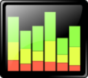

* `001-monitor.png` : Icon made by Smashicons from www.flaticon.com under [Flaticon Basic License](https://file000.flaticon.com/downloads/license/license.pdf)
* `002-save.png` : Icon made by Smashicons from www.flaticon.com under [Flaticon Basic License](https://file000.flaticon.com/downloads/license/license.pdf)
* `003-folder.png` : Icon made by Smashicons from www.flaticon.com under [Flaticon Basic License](https://file000.flaticon.com/downloads/license/license.pdf)
* `004-export.png` : Icon made by Pixel perfect from www.flaticon.com under [Flaticon Basic License](https://file000.flaticon.com/downloads/license/license.pdf)
* `005-cross.png` : Icon made by Smashicons from www.flaticon.com under [Flaticon Basic License](https://file000.flaticon.com/downloads/license/license.pdf)
* `006-pencil.png` : Icon made by Smashicons from www.flaticon.com under [Flaticon Basic License](https://file000.flaticon.com/downloads/license/license.pdf)
* `007-question.png` : Icon made by Smashicons from www.flaticon.com under [Flaticon Basic License](https://file000.flaticon.com/downloads/license/license.pdf)
* `008-saveas.png` : combining of  `002-save.svg` and `006-pencil.svg` authorized under [Flaticon Basic License](https://file000.flaticon.com/downloads/license/license.pdf)
* `logo.png `: Icon  under license [Creative Commons Zero 1.0 Public Domain License](https://creativecommons.org/publicdomain/zero/1.0/) and available at https://openclipart.org/detail/172389/graph
